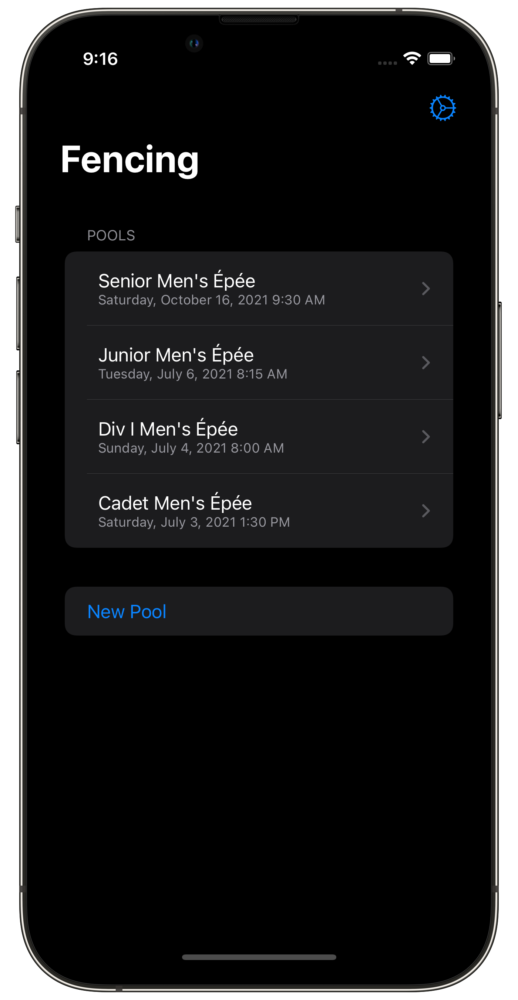
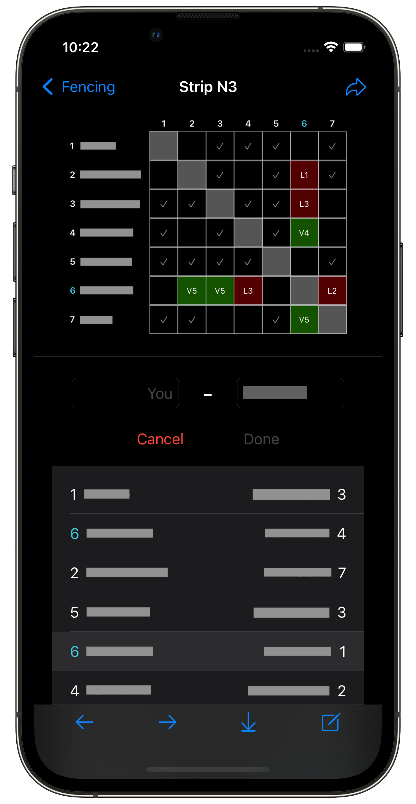
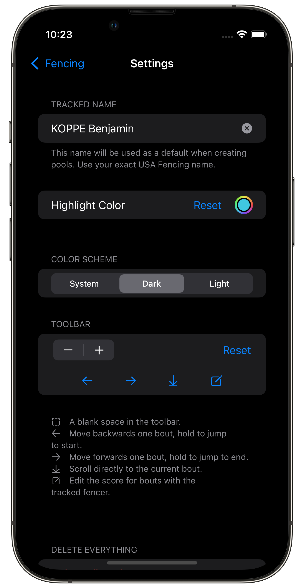

# FencingPools
FencingPools is an app that retrieves bout pools from FencingTimeLive, making it easy to enter scores and follow the bout order. With just a URL from their pool's 'details' page, FencingPools simplifies the process of tracking score logs and makes it easy to check your scores with your referee.
